**Activity 1: Express API**

**Author:** ADEWALE OLAOMO  
**Date:** 18 Feb 2026

**PROJECT OVERVIEW**

**1. Introduction**

### The focus of this task is to understand how modern backend applications are created, implemented, structured and connected to relational databases while following common practices through the use of building a RESTful web API called MusicAPI, which uses Node.js, TypeScript, Express.js, and MySQL as technologies. MusicAPI will follow the Model–View–Controller (MVC) architectural pattern and expose RESTful endpoints that enable clients to perform CRUD actions against music resources like albums and artists.

### This activity focuses on the use of asynchronous programming techniques, middleware, database connection pooling and REST conventions.

### 2. Technology Stack

- Backend Framework: Node.js with Express.js

- Programming Language: TypeScript

- Database: MySQL

- Middleware: CORS, Helmet, Custom Logger

- Tools: Nodemon, dotenv, Postman

- Version Control: Git & GitHub

## PROJECT SETUP & BUILD REFINEMENT

### 3. Refining the Build Process

The project was initialized as a Node.js application configured to run
using TypeScript. The **package.json** file was modified to define
custom scripts that simplify development and execution.

Key scripts include:

- npm run start – Runs the application using ts-node

- npm run start:watch – Runs the application with nodemon for automatic
  restarts

This setup mirrors real-world development workflows and provides insight
into how build tools operate behind modern frontend frameworks.

**Package_Json**

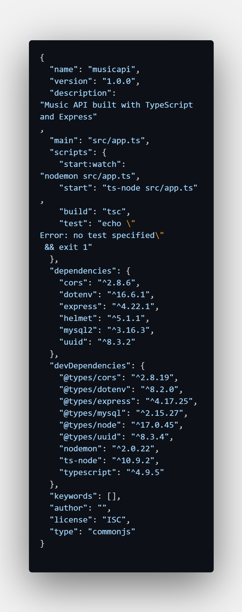

### 4. TypeScript Configuration

A **tsconfig.json** file was created to configure the TypeScript
compiler. This file ensures strict type checking, proper module
resolution, and compatibility with Node.js runtime environments.

Using TypeScript improves code quality, reduces runtime errors, and
enhances developer productivity through static typing.

**TypeScript Config file**

## ENVIRONMENT VARIABLES & CONFIGURATION

### 5. Environment Variable Management using dotenv

To properly manage application configuration data, the **dotenv**
library has been implemented. Sensitive information like database user
accounts and server ports are kept in a .env file and not hard-coded
into the app's source code. The objects defined by the
environment variables are now safe from prying eyes and may be found in
the following categories:

\- MySQL host, user, password, database

\- Server port

\- Application environment

This method increases the level of security for the application and
allows for easy portability of your application code from development to
test and to production.

**.env file**

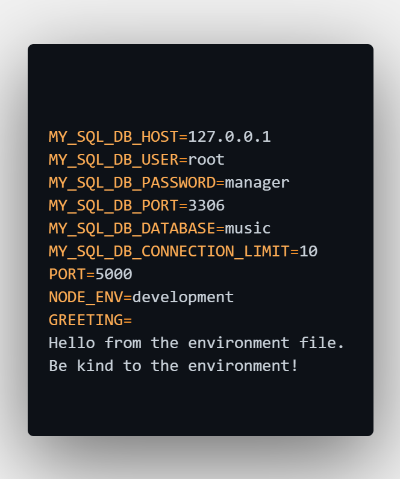

## APPLICATION ARCHITECTURE (MVC)

### 6. Model–View–Controller (MVC) Architecture

The MusicAPI application follows the MVC architectural pattern:

- **Model:** Defines data structures (Album, Artist, Track)

- **View:** JSON responses returned to API clients

- **Controller:** Contains business logic and request handling

- **Router:** Maps HTTP requests to controller methods

This separation of concerns makes the application modular, scalable, and
easier to maintain.

**Project folder structure**

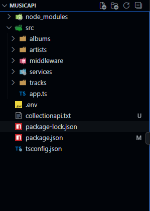

## ROUTERS & RESOURCE DESIGN

### 7. Router Implementation

Dedicated routers were created for each resource:

- Albums Router

- Artists Router

Each router defines RESTful endpoints and forwards requests to the
appropriate controller. Routers are combined and registered in the main
app.ts file.

Example endpoints:

- GET /albums

- GET /albums?albumId=7

- GET /artists

**albums.routes.ts**

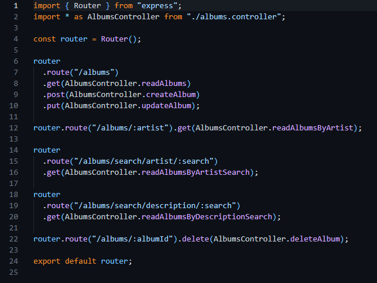\
👉

## MIDDLEWARE IMPLEMENTATION

### 8. Middleware Usage

Middleware plays a central role in Express applications. Several
middleware components were implemented:

#### a) Custom Logger Middleware

Logs request method, URL, and response time to help monitor API
performance.

#### b) Built-in & Third-Party Middleware

- JSON and URL-encoded body parsers

- CORS for cross-origin requests

- Helmet for security-related HTTP headers

**logger.middleware.ts**\
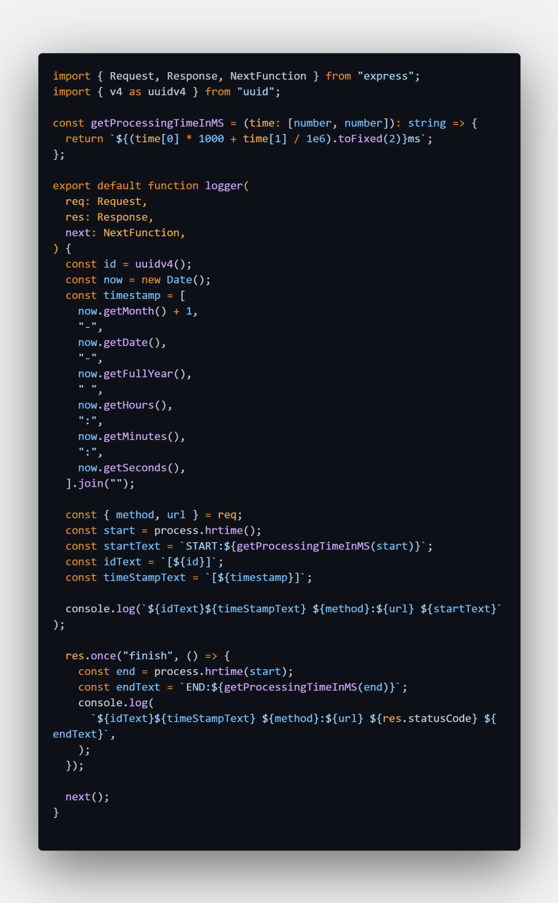

**app.ts**

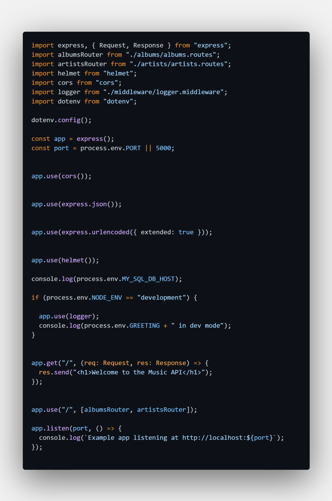

## DATABASE DESIGN & MYSQL INTEGRATION

### 9. MySQL Database Design

The application connects to a MySQL database named **music**, which
contains the following tables:

- Album

- Track

The database design follows relational principles and supports efficient
data retrieval.

### 10. MySQL Connection Pool

A MySQL connection pool was implemented to optimize performance.
Connection pooling avoids the overhead of creating a new database
connection for every request and supports multiple simultaneous users.

**mysql.connector.ts**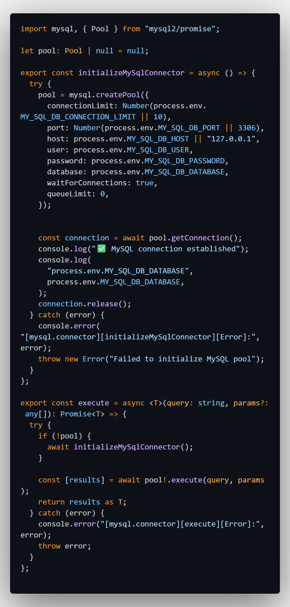

**DAO & QUERY IMPLEMENTATION**

**11. Data Access Objects (DAO)**

DAO classes encapsulate all database operations and communicate with the
MySQL connector. Each DAO method executes a specific SQL query using a
generic execute\<T\> method that returns a Promise.

DAOs implemented:

- albums.dao.ts

- artists.dao.ts

- tracks.dao.ts

**DAO files**

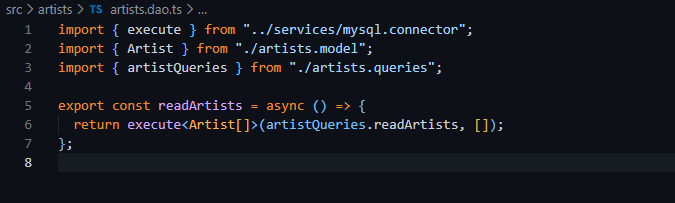

**12. SQL Query Management**

SQL queries were separated into dedicated files using template literals.
Parameterized queries were used to prevent SQL injection and ensure
secure database access.

**track.queries.ts** 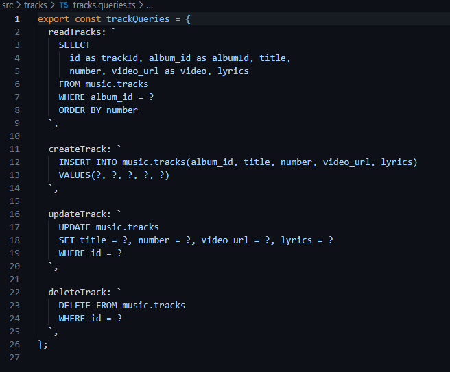

**CONTROLLER LOGIC & ASYNC PROCESSING**

**13. Albums Controller**

The Albums controller supports full CRUD functionality:

- Read all albums

- Read album by ID

- Create album

- Update album

- Delete album

- Search by artist and description

Query strings were used to support optional parameters, demonstrating
flexible API design.

**albums.controller.ts**

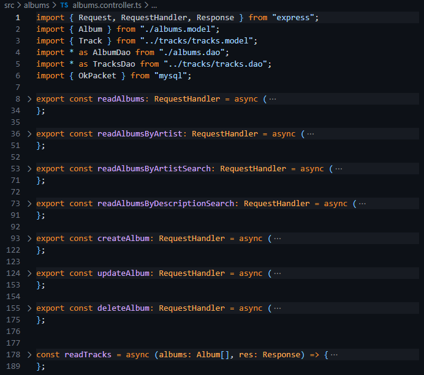

**14. Artists Controller**

The Artists controller supports read-only operations and retrieves
artist data indirectly from the album table.

**artists.controller.ts**

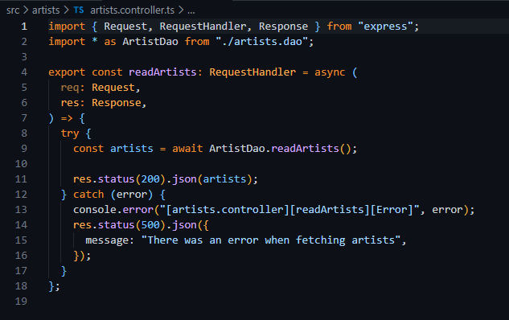

**RESTFUL API DESIGN & TESTING**

**15. RESTful API Principles**

The MusicAPI follows REST conventions:

- Resource-based URIs

- Stateless communication

- Use of HTTP verbs (GET, POST, PUT, DELETE)

- JSON-based responses

**16. API Testing using Postman**

All API endpoints were tested using Postman to verify:

- Correct routing

- CRUD operations

- Database connectivity

- Error handling

\*\*Postman request\*\*
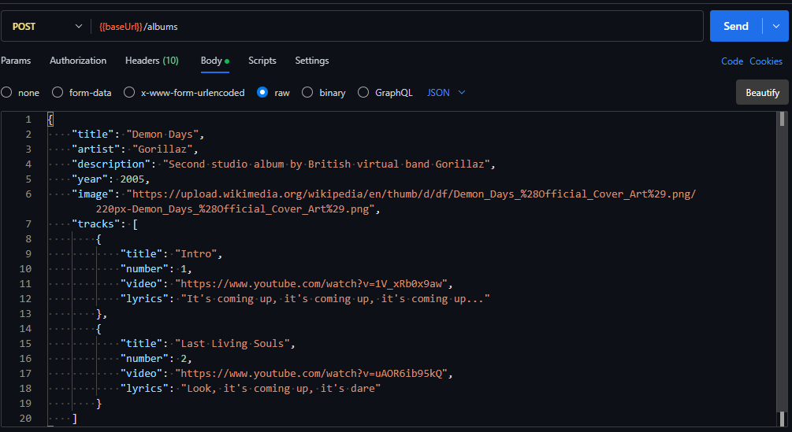

**Postman response**

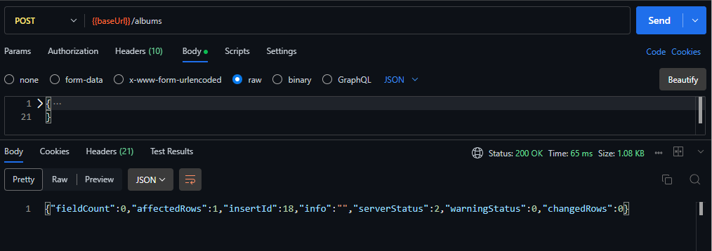

**LEARNING OUTCOMES & SUMMARY**

**17. Learning Outcomes**

Through this activity, the following skills were developed:

• Developed **RESTful** APIs using **Node.js** with **TypeScript**

• Incorporated MVC architecture into backend applications

• Implemented middleware and added logging functionality

• Connected **backend** applications to **MySQL** databases

• Used **async** programming with Promises

**18. Summary of Work**

Through this project you will learn about creating a professional
back-end API. This MusicAPI was built according to industry standards
and serves as a starting point for implementing front-end development in
either Angular or React.

## SUBMISSION DETAILS

### 19. Screencast Demonstration

**Screencast URL:**

https://www.loom.com/share/d107fb445c52443ab1f9d1b19dceccd3

The screencast demonstrates:

- API execution using Postman

- CRUD operations

- Explanation of router, controller, and DAO for one endpoint

## CONCLUSION

### 20. Conclusion

The MusicAPI project fulfills all requirements outlined in Activity 1.
It showcases a scalable, secure, and maintainable RESTful backend
system. The knowledge gained through this activity is directly
applicable to real-world software development and cloud-based
application design.
